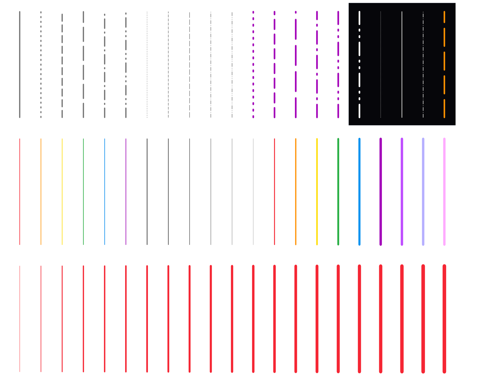
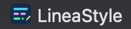
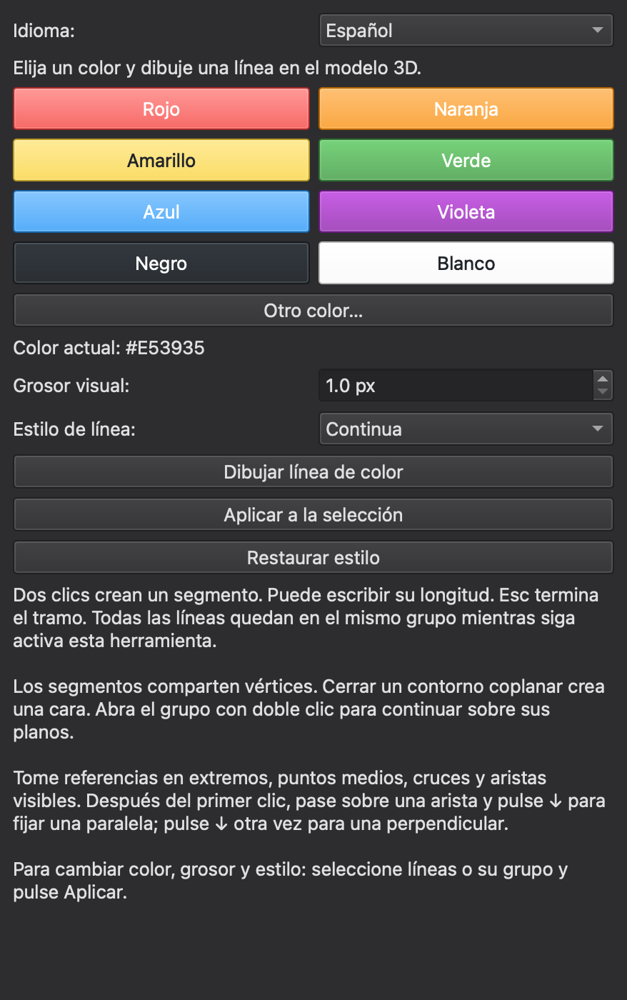

# JA LineaStyle · Manual de usuario / User manual

**Versión / Version 0.1.2 · IngeTrazo 0.5.7 (API de extensiones 2) · Julio Angulo · GPL-3.0-or-later**

[Español](#español) · [English](#english)

---

## Español

### 1. ¿Qué es JA LineaStyle?

JA LineaStyle es una herramienta para **dibujar líneas 3D con color, grosor y estilo
de trazo** dentro de IngeTrazo, y para cambiar esas propiedades en líneas existentes.
Sirve para:

- resaltar ejes, cotas de referencia, recorridos o límites de propiedad;
- diferenciar instalaciones (agua, eléctrica, gas) por color;
- dibujar líneas ocultas, de proyección o de eje con su trazo convencional;
- bocetar en 3D con lápices de colores.

Las líneas son geometría 3D real: se unen en los vértices, se dividen en los cruces
y **un contorno cerrado y plano forma una cara**, como con la herramienta Línea nativa.

*Arriba: los seis estilos de trazo en distintos grosores y colores, también sobre fondo
oscuro. Centro: paleta y colores personalizados. Abajo: progresión de grosores en pantalla.*

### 2. Instalación

1. Descarga `ja_lineastyle-0.1.2.zip` desde el catálogo de IngeTrazo o desde
   [las versiones del repositorio](https://github.com/wrc86/ja-ingetrazo-extensions/releases).
2. Descomprímelo. Obtendrás una carpeta llamada **`lineas_color`**
   (es el nombre interno; se conserva para actualizar versiones anteriores).
3. En IngeTrazo abre **Extensiones → Abrir carpeta de plugins**.
4. Copia allí la carpeta `lineas_color` completa. Si tenías «Líneas de colores»,
   reemplaza la carpeta existente.
5. Reinicia IngeTrazo.

**Desinstalar:** cierra IngeTrazo y borra la carpeta `lineas_color`.

### 3. Abrir el panel

- Menú **Extensiones → JA LineaStyle…**, o
- clic derecho en la vista 3D → **JA LineaStyle**.

El panel aparece como pestaña **LineaStyle** con su icono:

### 4. Controles del panel

| Control | Qué hace |
|---|---|
| **Paleta de colores** | Rojo, Naranja, Amarillo, Verde, Azul, Violeta, Negro y Blanco. |
| **Otro color…** | Abre el selector para cualquier color. |
| **Color actual** | Muestra el código del color activo (por ejemplo `#E53935`, el rojo de la paleta). |
| **Grosor visual** | De **1 a 12 px**. Es grosor en pantalla: se mantiene igual al hacer zoom y no añade espesor físico. |
| **Estilo de línea** | **Continua**, **Punteada**, **Interrumpida**, **Raya larga**, **Punto y raya**, **Dos puntos y raya**. |
| **Dibujar línea de color** | Activa la herramienta de dibujo. |
| **Aplicar a la selección** | Aplica color, grosor y estilo actuales a las líneas o grupos seleccionados. |
| **Restaurar estilo** | Quita el estilo del plugin y vuelve al aspecto normal. |

Debajo de los botones, el panel recuerda las reglas básicas: dos clics crean un
segmento, Esc termina el tramo, todo queda en el mismo grupo y, para cambiar estilos,
se selecciona y se pulsa **Aplicar**.

#### Cuándo usar cada estilo (convención sugerida)

| Estilo | Uso habitual en dibujo arquitectónico |
|---|---|
| **Continua** | Contornos visibles, bordes, recorridos. |
| **Punteada** | Elementos ocultos o proyectados de poca importancia, límites de vegetación. |
| **Interrumpida** | Aristas ocultas, elementos por encima del plano de corte (aleros, voladizos). |
| **Raya larga** | Proyecciones, límites de zonas o áreas de influencia. |
| **Punto y raya** | Ejes, ejes de simetría, líneas de centro. |
| **Dos puntos y raya** | Límites de propiedad, linderos, retiros. |

### 5. Dibujar

1. Elige color, grosor y estilo.
2. Pulsa **Dibujar línea de color**. El cursor se convierte en un **lápiz del color
   elegido**; la punta del lápiz es el punto exacto del clic.
3. Haz clic en el punto inicial y luego en el final. Puedes seguir encadenando segmentos.
4. Puedes **escribir una longitud** mientras dibujas y usar las inferencias y los
   bloqueos de eje del dibujo nativo.
5. **Esc** termina el tramo actual (puedes empezar otro en el mismo grupo).
6. **Espacio** vuelve a la herramienta Seleccionar.

**Cómo se agrupa:** todo lo que dibujas mientras la herramienta sigue activa queda en
**un solo grupo**, aunque cambies de color o estilo. Cada arista guarda su propio
color, grosor y estilo. Si cambias a otra herramienta y vuelves, se crea un grupo nuevo.

**Caras:** cerrar un contorno en un mismo plano crea una cara; una diagonal puede dividir
un plano en dos caras. Los contornos que no son planos no forman superficies.

**Seguir dibujando en un grupo:** haz **doble clic** en el grupo para abrirlo y vuelve
a **Dibujar**: las líneas nuevas se agregan a esa misma malla, sin crear subgrupos.

**Referencias al dibujar:** acerca la punta del cursor a extremos, puntos medios,
cruces o cualquier punto de una arista visible. Funcionan las líneas nativas y los
seis estilos de JA LineaStyle, también en los huecos del patrón, en grupos girados
o anidados y sobre las líneas recién dibujadas. Después del primer clic, pasa por una
arista y pulsa **↓** para fijar una dirección paralela, otra vez para una perpendicular
y otra vez para liberarla. **Shift** mantiene una inferencia activa; las otras flechas
bloquean los ejes nativos. La geometría oculta no ofrece referencias.

### 6. Cambiar el estilo de líneas existentes

1. Selecciona un grupo dibujado con JA LineaStyle, o abre el grupo y selecciona aristas sueltas.
2. Elige el nuevo color, grosor o estilo.
3. Pulsa **Aplicar a la selección**.

- **Clic derecho → colores:** cambia solo el color y conserva el grosor y el patrón de cada arista.
- **Líneas sueltas del modelo:** al aplicarles estilo se reúnen en **un solo grupo**.
- **Aristas de caras sueltas:** agrupa primero la geometría (herramientas nativas).
- **Restaurar estilo** sobre el grupo quita todas sus propiedades visuales (la malla y las
  caras se conservan); sobre aristas dentro del grupo, les devuelve el estilo por defecto del grupo.

> Mientras una línea está seleccionada se ve con el resaltado naranja de IngeTrazo.
> Deselecciona para ver su color.

### 7. Guardar, deshacer y exportar

- Crear, aplicar y restaurar se pueden **deshacer y rehacer**.
- Mover, rotar, escalar, copiar y borrar usan las herramientas nativas.
- Guarda como **.igz** para conservar las líneas y sus estilos.
- Los colores se ven en la vista 3D y en **imágenes raster** generadas por el modelo
  (también en láminas renderizadas como imagen).
- Los estilos **no** se exportan a `.skp`, DXF, Blender ni a láminas vectoriales:
  allí las líneas salen con el estilo normal.
- **Explotar** un grupo elimina sus estilos del plugin.
- Para ver los estilos en otro computador se necesita la extensión instalada.

Abre `Ejemplo_JA_LineaStyle.igz` (incluido en el repositorio) para ver los seis
estilos y dos caras conectadas dentro de un único grupo.

### 8. Detalles técnicos útiles

- Los huecos de las líneas punteadas son **solo visuales**: cada arista sigue completa
  para caras, inferencias y selección.
- Las caras ocultan las líneas que quedan detrás; se respetan etiquetas ocultas y planos de sección.
- Si una versión futura de IngeTrazo no admite el renderizador del plugin, el panel lo avisa
  y las líneas siguen visibles con el color normal.
- La interfaz está en español.

### 9. Problemas frecuentes

| Problema | Solución |
|---|---|
| No veo el color de una línea | Puede estar seleccionada (naranja). Haz clic en vacío para deseleccionar. |
| «La selección ya tiene ese estilo» | No hay cambios que aplicar; elige otro color, grosor o estilo. |
| No puedo aplicar estilo a aristas de una caja | Agrupa primero la geometría y vuelve a aplicar. |
| El estilo se perdió | ¿Exploté el grupo o exporté a DXF/SKP? Esos formatos no guardan el estilo. Usa **Deshacer** o abre el .igz. |
| No aparece en el menú | Verifica que la carpeta se llame `lineas_color` y contenga `__init__.py`; reinicia IngeTrazo. |

### Autor

**Julio Eduardo Angulo** — arquitecto colombiano, fundador y director de diseño de
**[Línea Prima](https://lineaprima.co)**, estudio de arquitectura, diseño y construcción
en Bogotá. Desde 2009 proyecta y construye, con 77 proyectos en Colombia, Puerto Rico
y Estados Unidos, bajo un modelo *Design & Build*: un mismo equipo del concepto a la obra
terminada. Línea Prima hace «arquitectura para durar»: atmósfera, materia honesta y
precisión. Estas extensiones nacen de su práctica diaria con BIM y herramientas digitales.

- Web: [lineaprima.co](https://lineaprima.co) · Perfil: [lineaprima.co/julio-eduardo-angulo](https://lineaprima.co/julio-eduardo-angulo/)
- Correo: info@lineaprima.co · Instagram: [@buskua.co](https://instagram.com/buskua.co)
- Código y reportes de errores: [github.com/wrc86/ja-ingetrazo-extensions](https://github.com/wrc86/ja-ingetrazo-extensions/issues)

---

## English

### 1. What is JA LineaStyle?

JA LineaStyle is a tool to **draw 3D lines with colour, weight and line style** in
IngeTrazo, and to restyle existing lines. Use it to highlight axes, paths or property
limits, colour-code services (water, power, gas), draw hidden/projection/centre lines
with their conventional pattern, or sketch in 3D with coloured pencils.

Lines are real 3D geometry: they join at vertices, split at crossings and
**a closed planar outline becomes a face**, just like the native Line tool.

*Top: the six line styles at several weights and colours, also on a dark background.
Middle: palette and custom colours. Bottom: on-screen weight progression.*

> **Note:** the interface is in Spanish. Spanish labels are shown in parentheses.

### 2. Installation

1. Download `ja_lineastyle-0.1.2.zip` from the IngeTrazo catalog or the
   [repository releases](https://github.com/wrc86/ja-ingetrazo-extensions/releases).
2. Unzip it. You get a folder named **`lineas_color`** (internal name, kept for upgrades).
3. In IngeTrazo open **Extensions → Open plugins folder** and copy the folder there.
4. Restart IngeTrazo.

**Uninstall:** close IngeTrazo and delete the `lineas_color` folder.

### 3. Opening the panel

**Extensions → JA LineaStyle…** or right-click in the 3D view → **JA LineaStyle**.
It appears as a **LineaStyle** panel tab:

### 4. Panel controls

| Control | What it does |
|---|---|
| **Palette** | Red, Orange, Yellow, Green, Blue, Violet, Black, White. |
| **Other colour…** (*Otro color…*) | Opens a colour picker. |
| **Current colour** (*Color actual*) | Shows the active colour code, e.g. `#E53935` (palette red). |
| **Visual weight** (*Grosor visual*) | **1–12 px** on screen; constant when zooming, no physical thickness. |
| **Line style** (*Estilo de línea*) | Solid (*Continua*), Dotted (*Punteada*), Dashed (*Interrumpida*), Long dash (*Raya larga*), Dash-dot (*Punto y raya*), Dash-dot-dot (*Dos puntos y raya*). |
| **Draw coloured line** (*Dibujar línea de color*) | Starts the drawing tool. |
| **Apply to selection** (*Aplicar a la selección*) | Applies current colour, weight and style to the selected lines/groups. |
| **Restore style** (*Restaurar estilo*) | Removes the plugin style. |

#### Suggested use of each style

| Style | Typical architectural use |
|---|---|
| **Solid** | Visible outlines, edges, paths. |
| **Dotted** | Minor hidden/projected elements, planting limits. |
| **Dashed** | Hidden edges, elements above the cut plane (eaves, overhangs). |
| **Long dash** | Projections, zone limits. |
| **Dash-dot** | Axes, centre lines, symmetry lines. |
| **Dash-dot-dot** | Property lines, boundaries, setbacks. |

### 5. Drawing

1. Pick colour, weight and style, then press **Draw coloured line**. The cursor becomes
   a **pencil in the chosen colour**; its tip is the exact click point.
2. Click a start point and an end point; keep clicking to chain segments. You can **type a
   length** and use native inferences and axis locks.
3. **Esc** ends the current run; **Space** returns to Select.

Everything drawn while the tool stays active goes into **one group**, even if you change
colour or style; each edge keeps its own properties. Switching tools and coming back
starts a new group. **Double-click** a group to open it and keep drawing in the same mesh.
Closing a planar outline creates a face; non-planar outlines do not.

**Drawing references:** aim the pencil tip at endpoints, midpoints, intersections
or any point on a visible edge. Native lines and all six JA LineaStyle patterns work,
including visual gaps, rotated or nested groups and lines drawn in the current session.
After the first click, hover an edge and press **↓** to lock parallel to it, again for
perpendicular and again to release. **Shift** holds the current inference; the other
arrows lock native axes. Hidden geometry does not attract references.

### 6. Restyling existing lines

Select a JA LineaStyle group (or open it and select edges), choose new properties and
press **Apply to selection**. Right-click → colours changes only the colour. Loose model
lines are gathered into **one group** when styled; edges of loose faces must be grouped
first. **Restore style** on a group removes all plugin styling (mesh and faces stay).
Selected lines show IngeTrazo's orange highlight — deselect to see their colour.

### 7. Saving, undo and export

- Create, apply and restore support **undo/redo**; move/rotate/scale/copy/delete are native.
- Save as **.igz** to keep styles. Colours show in the 3D view and in **raster** images/sheets.
- Styles are **not** exported to `.skp`, DXF, Blender or vector sheets.
- **Exploding** a group removes its plugin styles. Other computers need the extension installed.

Open `Ejemplo_JA_LineaStyle.igz` (in the repository) to see all six styles.

### 8. Troubleshooting

| Problem | Fix |
|---|---|
| Line colour not visible | It may be selected (orange). Click empty space. |
| "Selection already has that style" | Nothing to change; pick a different property. |
| Can't style edges of a box | Group the geometry first. |
| Style lost | Exploded the group or exported to DXF/SKP? Use **Undo** or reopen the .igz. |
| Not in the menu | Folder must be named `lineas_color` and contain `__init__.py`; restart IngeTrazo. |

### Author

**Julio Eduardo Angulo** — Colombian architect, founder and design director of
**[Línea Prima](https://lineaprima.co)**, an architecture, design and construction studio
in Bogotá. Designing and building since 2009, with 77 projects in Colombia, Puerto Rico
and the United States under a *Design & Build* model: one team from concept to finished
building. Línea Prima makes "architecture to last": atmosphere, honest materials and
precision. These extensions come from his daily practice with BIM and digital tools.

- Web: [lineaprima.co](https://lineaprima.co) · Profile: [lineaprima.co/julio-eduardo-angulo](https://lineaprima.co/julio-eduardo-angulo/)
- Email: info@lineaprima.co · Instagram: [@buskua.co](https://instagram.com/buskua.co)
- Code and bug reports: [github.com/wrc86/ja-ingetrazo-extensions](https://github.com/wrc86/ja-ingetrazo-extensions/issues)
